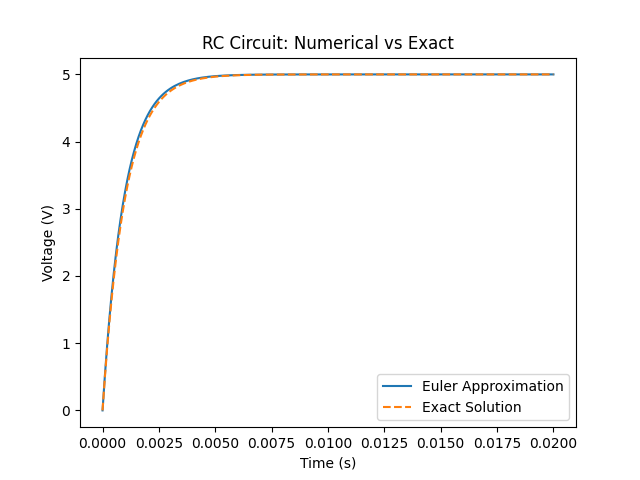
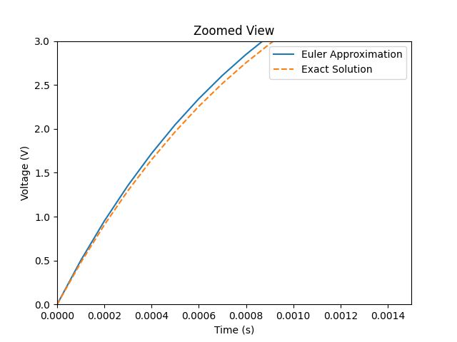
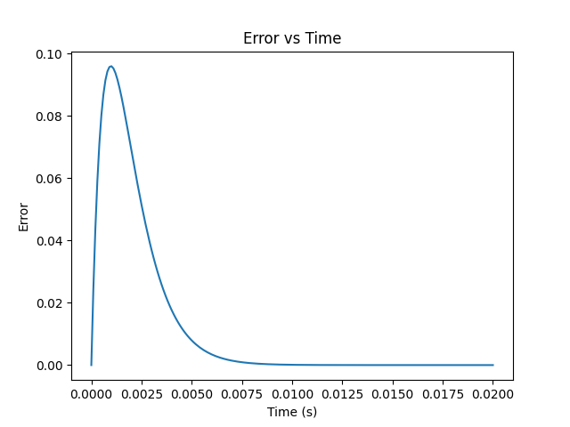
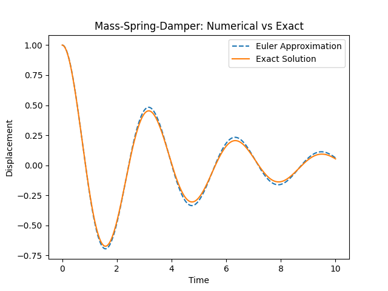
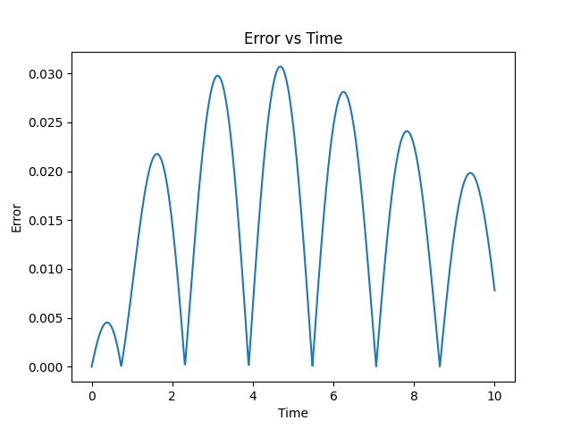

# Introduction 
This project investigates numerical solutions to differential equations using Euler's Method. The goal is to approximate solutions to a first-order differential equation and analyze how step-size affects accuracy.

# Mathematical Model 
Consider the following differential equation with a initial value, $y(0)$:
$$
\dfrac{dy}{dt}=y, \quad y(0)=1 \tag{1}
$$

Equation (1) is a **first-order linear ordinary differential equation (ODE)**. This is the fundamental language of autonomous decay. In a physical or computational system, it describes a state where the "pressure" to change is directly proportional to the current magnitude of the system itself. To understand the solution to this equation, we can try to analyze it through solving it.

## Analytical Derivation 
Equation (1) actually the form of a **separable first-order ODE**. These are usually the easiest form of differential equations and the steps to solve them are fairly straightforward, considering one has a basic knowledge of calculus. 

Step 1: We rearrange the equation to group all the $y$ terms on the left, and those involving $t$ to the right.
$$
\dfrac{1}{y}dy = 1dt
$$
Step 2: We integrate both sides:
$$
\begin{align}
\int \dfrac{1}{y} \, dy &= \int 1 \, dt \\[6pt]
\ln|y| &= t+C
\end{align}
$$
where $C$ represents the constant of integration.

Step 3: Take the natural exponent, $e$, of both sides to isolate $y$ (in other words, remove the $\ln$ term):
$$
\begin{align}
e^{\ln y} &= e^{t+C} \\[4pt]
y &= e^{C} \cdot e^{t}
\end{align}
$$
the term $e^{C}$ can be simplified into a arbitrary constant, $A$, where $A \neq 0$:
$$
y(t) = Ae^{t}
$$
Step 4: Applying the initial condition $y(0)=1$:
$$
\begin{align}
1 = Ae^{0} \implies A = 1
\end{align}
$$
Therefore the unique solution to our system is the exponential decay function:
$$
y(t) = e^{t} 
$$

Intuitively, one can think about the solution to equation (1) by thinking of a function, $y(t)$ that satisfies the relation. In other words, what function, when differentiated, yields the same function $y(t)$. To those with basic knowledge of calculus, you can infer that:
$$
y(t) = e^{t} \text{ as } \dfrac{dy}{dt} \, e^{t} = e^{t}.
$$
# Euler's Method 
There are some differential equations in which solutions are non-elementary (that is, not expressed in terms of elementary functions). In addition, there are also a fairly large set of differential equations that are not easy to sketch direction fields for. In these cases we result to numerical methods that can be used to approximate solutions to a differential equation. Consider the unique solution to the initial value problem 
$$
\dfrac{dy}{dx}=f(x,y), \quad y(x_{0})=y_{0} \tag{2.0.1}
$$
Suppose we wish to approximate the solution to the initial value problem (2.0.1) at $x=x_{1}=x_{0}+h$ where $h$ is small. The idea behind Euler's method is to use the tangent line to the solution curve through $(x_{0},y_{0})$ to obtain such an approximation.  In summary, this method for approximating the solution at the points $x_{n+1}=x_{0}+nh \, (n = 0,1,\dots)$ is
$$
y_{n+1}=y_{n}+hf(x_{n},y_{n}), \quad n = 0,1,\dots \tag{2.0.2}
$$
This method is meant to be implemented iteratively, meaning that the outputs are used as the new inputs.

# Application: RC Circuit Model (Charging)

## Introduction
An RC circuit consists of a resistor $R$ and a capacitor $C$ connected to a voltage source. This system provides a simple but important example of how electrical components store and dissipate energy over time. When a voltage is applied, the capacitor does not charge instantaneously; instead, its voltage evolves gradually due to the resistance in the circuit.  A sample circuit is given below:

<i>Figure 1: Simple RC Circuit with switch in the off position.</i>

The behaviour of the circuit can be modeled using Kirchhoff's Voltage Law, which leads to a first-order differential equation describing the voltage across the capacitor. Specifically, the rate of change of the capacitor voltage depends on the difference between the input voltage and the current capacitor voltage. 
$$
\dfrac{dV}{dt}=\dfrac{1}{RC}(V_{in}-V) \tag{3.0.1}
$$
This equation captures the dynamic response of the circuit and shows that the system evolves toward an equilibrium where the capacitor voltage equals the input voltage. The characteristic timescale of this process is determined by the time constant, $\tau = RC$, which governs how quickly the system approaches steady state. 

## Analytical Solution 
The solution to equation $(3.0.1)$ is known, which is described as
$$
V(t) = V_{in}(1-e^{-1/(RC)}) \tag{3.0.2}
$$

Well, what does this equation mean? Here is a plot of this function $V(t)$:

<i>Figure 2: Graph of V(t).</i>

Let us analyze this more deeply. Consider the special time $t = \tau$.
$$
\begin{align}
V(\tau) &= C\Delta V(1-^{-\tau/\tau}) \\[6pt]
&= C\Delta V (1-\dfrac{1}{e})
\end{align}
$$
where $1-\dfrac{1}{e}\approx\dfrac{2}{3}$. This implies that it takes 3-4 time constants, $\tau = RC$, to fully charge the capacitor. 

## Numerical Method 
To approximate the solution, Euler's method is applied.
$$
V_{n+1}=V_{n}+h \cdot \dfrac{1}{RC}(V_{in}-V_{n}) \tag{3.0.3}
$$

## Simulation Results 

To evaluate the effectiveness of Euler's method, the numerical approximation of the RC circuit was compared with the exact analytical solution. The Python simulation was performed using a fixed timestep $h$, and the capacitor voltage was computed iteratively over time. 

The circuit has the following parameters:
1. `V_in = 5`: $5$V input voltage applied to the circuit.
2. `R = 1000`: $1$k$\Omega$ resistor. Avoids extremely fast/slow charging.
3. `C = 1e-6`: $1\mu$F capacitor. Gives a time constant in the millisecond range. 

I have also chosen time step value of `h = 0.0001` to ensure reasonable accuracy. 

The figure below shows my results: 

<i>A plot of the results.</i>

This initial result shows that the Euler approximation closely follows the exponential charging curve of the exact solution, particularly for small values of the timestep. 

However, slight deviations become noticeable as time progresses.

This is due to the accumulation of local truncation error at each step. Since Euler's Method approximates the solution using linear steps, it cannot perfectly capture the curvature of the exponential function, creating this gap. 

## Error Analysis 
To evaluate the accuracy of the numerical method, the Euler approximation is compared to the exact solution of the RC circuit as shown in $(3.0.2)$. The error at each time step $h$ is defined as:
$$
\text{Error} = |V_{\text{exact}} - V_{\text{numerical}}| \tag{3.0.4}
$$
where $V_{\text{exact}}$ is a solution obtained from $(3.0.2)$ while the latter is obtained from the Euler's Method approximation in $(3.0.3)$.

The error behaviour plot is shown as follows:

The error initially exhibits a noticeable spike at early times, followed by a gradual decay and eventual stabilization near zero. This behaviour can be explain by the dynamics of the system. To be clear, we are now solving
$$
\dfrac{dV}{dt} = \dfrac{1}{RC}(V_{in}-V)
$$

At $t \approx 0$, the slope is largest because the term $V_{in}-V_{n}$ is large. Euler's method takes a **linear step**, but the true solution is curving sharply. As a result, the largest local error occurs early, therefore the spike.

As time increases, $V$ gets closer to $V_{in}$, where the slop gets smaller:
$$
\dfrac{dV}{dt} \to 0
$$
The system changes more slowly, but the Euler approximation becomes more accurate, therefore the error begins to decrease. 

Eventually, both numerical and exact solutions approach:
$$
V(t) \to V_{in}
$$
where $\dfrac{dV}{dt}=0$ so the updates become very small. The difference between them becomes tiny and stable, the error flattens near 0.

# Application: Mass-Spring Damper System
## Introduction 
The mass-spring-damper system models the motion of a mass attached to a spring with damping. This system captures important physical behaviours such as oscillation, energy dissipation, and stability. It is widely used in mechanical systems and has a direct mathematical analogy to electrical RLC circuits (yes!). The governing equation is
$$
mx'' + cx' +kx = 0 \tag{4.0.1}
$$
where $m$ is the mass, $c$ is the damping coefficient, $k$ is the spring constant, and $x(t)$ is the displacement. 

## Conversion to First-Order System 
To apply Euler's method, the second-order DE must be rewritten as a system of first-order DEs. Let
$$
\begin{align}
x_{1} = x \text{ (position)} \\
x_{2} = x' \text{ (velocity)}
\end{align}
$$
Then:
$$
\begin{align}
x_{1}' &= x_{2} \\[5pt]
x_{2}' &= -\dfrac{c}{m}x_{2} - \dfrac{k}{m}x_{1}
\end{align}
$$
This system can now be solved numerically. 

## Analytical Solution 
Equation $(4.0.1)$ depends on the relationship between the parameters $m, c$ and $k$. The discriminant is defined as:
$$
c^{2} - 4mk
$$
For the **underdamped case** ($c^{2}<4mk$), which produces oscillatory motion, the solution is:
$$
x(t) = e^{(-e/2m)t}(A\cos(\omega t)+B\sin(\omega t)) 
$$

where 
$$
\omega = \sqrt{ \dfrac{k}{m} - \dfrac{c^{2}}{4m^{2}} }
$$
The constants $A$ and $B$ are determined by the initial conditions. 

## Numerical Method
Euler's Method is applied to both equations simultaneously:
$$
\begin{align}
x_{1,n+1} &= x_{1,n}+hx_{2,n} \\[6pt]
x_{2,n+1} &= x_{2,n}+h \left(-\dfrac{c}{m}x_{2,n}-\dfrac{k}{m}x_{1,n}\right)
\end{align}
$$
These produce approximate values for position and velocity over time. 

## Results
Similar to the previous application, below is a plot of the numerical and exact solutions to this system plotted against time:

Here is the error vs time graph of this system.

It is worth noting that both solutions exhibit oscillatory behaviour with decaying amplitude, consistent with the underdamped nature of the system. However, several differences were observed. 

1. The Euler approximation shows slight deviation in amplitude over time
2.  A small phase shift develops, causing the numerical solution to lag behind the exact solution.
3. The error is initially small but grows due to accumulated numerical approximation. 

The error plot confirms that:
1. Large deviations occur during periods of rapid change. 
2. Numerical inaccuracies accumulate over time in oscillatory systems. 

## Discussion 
Unlike the RC Circuit, the mass-spring-damper system is more sensitive to numerical error due to its oscillatory nature. Euler's method introduces both amplitude and phase errors, making it less suitable for accurately simulating long-term oscillatory behaviour. 

