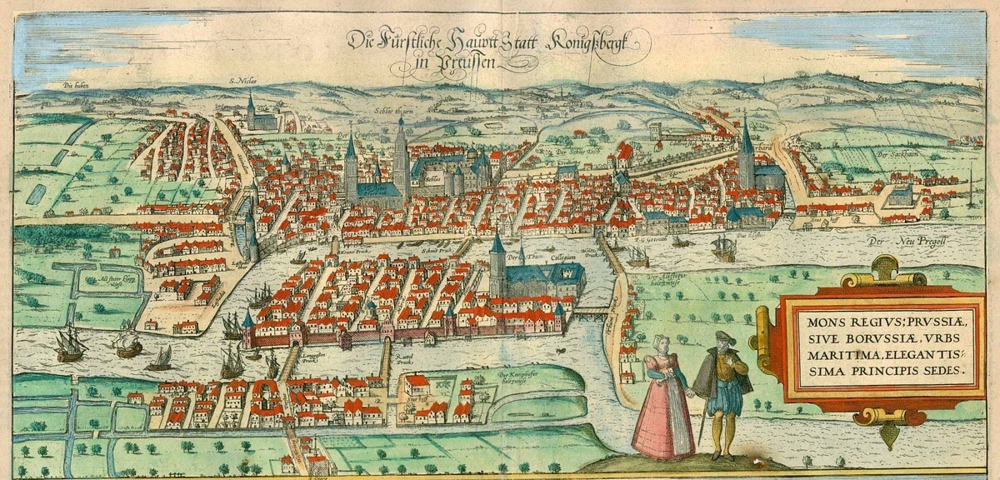

## Overview

How does a navigation system determine the "best" route from one location to another?

This project explores three classical pathfinding algorithms—Breadth-First Search (BFS), Dijkstra's Algorithm, and A* Search—through the lens of graph theory and optimization. Using a simplified road network based on [Kelowna, British Columbia](https://www.openstreetmap.org/?#map=11/49.8995/-119.5402), I investigated how different mathematical assumptions lead to different navigation strategies.

The project sits at the intersection of discrete mathematics, optimization, and computer science, demonstrating how abstract mathematical structures underpin modern navigation systems.

## Historical Context

The foundations of pathfinding can be traced to graph theory, beginning with Euler's solution to the [Königsberg Bridge Problem](https://mathworld.wolfram.com/KoenigsbergBridgeProblem.html) in 1736. By representing locations as vertices and connections as edges, Euler established a mathematical framework for studying networks.



In the twentieth century, researchers developed increasingly sophisticated methods for navigating graphs:

* **Breadth-First Search (1950s)** introduced systematic graph traversal.
* **Dijkstra's Algorithm (1959)** extended shortest-path computation to weighted networks.
* **A* Search (1968)** incorporated heuristics to improve efficiency while preserving optimality.

Together, these algorithms form a natural progression from exhaustive search to intelligent search.

## Modeling Kelowna as a Graph

A transportation network can be represented as a graph

$$
G=(V,E),
$$

where:

* $V$ is the set of vertices (intersections or destinations),
* $E$ is the set of edges (roads).

Each edge is assigned a weight

$$
w:E\rightarrow \mathbb{R}_{\ge 0},
$$

representing distance or travel cost.

The shortest-path problem seeks a path $P$ minimizing

$$
\operatorname{Cost}(P)=\sum_{e\in P} w(e).
$$

For this project, locations throughout Kelowna were modeled as vertices, while road segments formed weighted edges between them.

## Breadth-First Search

Breadth-First Search (BFS) explores a graph level by level.

When every edge is assigned equal weight, the distance to a vertex $v$ is

$$
d(v)=\min {\text{number of edges from } s \text{ to } v}.
$$

BFS guarantees the shortest path in an unweighted graph because all vertices at distance $k$ are explored before any vertex at distance $k+1$.

### Strengths

* Simple implementation
* Guaranteed shortest path in unweighted networks

### Limitations

* Cannot distinguish between long and short roads
* Unsuitable for realistic transportation networks

In the Kelowna model, BFS often selected routes with the fewest road segments rather than the shortest physical distance.

## Dijkstra's Algorithm

[Dijkstra](https://en.wikipedia.org/wiki/Edsger_W._Dijkstra)'s Algorithm generalizes BFS to weighted graphs.

For each vertex $v$, we maintain the smallest known distance

$$
d(v).
$$

The algorithm repeatedly performs a relaxation step:

$$
d(v)=\min{d(v),, d(u)+w(u,v)}.
$$

By repeatedly selecting the unexplored vertex with minimum tentative distance, the algorithm constructs a shortest-path tree rooted at the source.

### Mathematical Perspective

Dijkstra's Algorithm is a greedy optimization method.

The key theorem states that when all edge weights satisfy

$$
w(e)\ge 0,
$$

the vertex with smallest tentative distance is guaranteed to have reached its optimal value.

### Application to Kelowna

Using road distances as weights, Dijkstra's Algorithm consistently produced the shortest routes between major locations such as Downtown Kelowna, Glenmore, Rutland, and UBC Okanagan.

## A* Search

A* Search augments Dijkstra's Algorithm with a heuristic estimate of the remaining distance to the goal.

For each vertex $n$,

$$
f(n)=g(n)+h(n),
$$

where

* $g(n)$ is the cost already travelled,
* $h(n)$ estimates the remaining cost.

For geographic networks, a natural heuristic is Euclidean distance:

$$
h(n)=\sqrt{(x-x_g)^2+(y-y_g)^2}.
$$

This heuristic is derived directly from the Pythagorean Theorem.

### Admissibility

A heuristic is called *admissible* if

$$
h(n)\le h^*(n),
$$

where $h^*(n)$ is the true remaining distance.

Under this condition, A* is guaranteed to return an optimal path.

### Application to Kelowna

Because the locations possess natural geographic coordinates, [Euclidean distance](https://mathworld.wolfram.com/Distance.html) provided an effective heuristic. A* produced the same optimal routes as Dijkstra's Algorithm while exploring fewer vertices.

## Comparison

| Algorithm | Mathematical Idea         | Optimal?         |
| --------- | ------------------------- | ---------------- |
| BFS       | Graph distance            | Yes (unweighted) |
| Dijkstra  | Weighted optimization     | Yes              |
| A*        | Optimization + heuristics | Yes              |

Conceptually, the algorithms answer increasingly sophisticated questions:

1. **BFS:** Which destination can be reached in the fewest steps?
2. **Dijkstra:** Which route minimizes total travel cost?
3. **A\*:** Which route minimizes cost while intelligently estimating the remaining journey?

## Reflection

This project demonstrates how graph theory provides a powerful framework for modeling real-world transportation systems. By applying BFS, Dijkstra's Algorithm, and A* Search to a network inspired by Kelowna, I explored the mathematical evolution of shortest-path algorithms and their practical implications for navigation.

What begins as a collection of roads and intersections can ultimately be understood as an optimization problem on a graph, revealing the deep connection between mathematics and everyday technology.


# Wayfinder Widget

```{=html}
<link rel="stylesheet" href="https://cdnjs.cloudflare.com/ajax/libs/leaflet/1.9.4/leaflet.min.css">
<script src="https://cdnjs.cloudflare.com/ajax/libs/leaflet/1.9.4/leaflet.min.js"></script>
<link href="https://fonts.googleapis.com/css2?family=IBM+Plex+Mono:wght@400;500&display=swap" rel="stylesheet">

<style>
#kw-widget {
  font-family: inherit;
  border: 1px solid rgba(255,255,255,.1);
  border-radius: 12px;
  overflow: hidden;
  display: flex;
  flex-direction: column;
  height: 640px;
  margin: 2rem 0;
  --kw-path: #3FE0C5;
  --kw-explored: #F2A93B;
  --kw-ink: #0C151E;
  --kw-panel: #111B26;
  --kw-border: rgba(255,255,255,.1);
  --kw-dim: #7A8A98;
  --kw-ui: #ECF0F4;
  --kw-error: #ff8a7a;
  --kw-mono: 'IBM Plex Mono', monospace;
}
.kw-top {
  flex: 0 0 auto;
  display: flex;
  flex-wrap: wrap;
  align-items: center;
  gap: 8px;
  padding: 10px 14px;
  background: var(--kw-panel);
  border-bottom: 1px solid var(--kw-border);
}
.kw-field-lbl {
  font-family: var(--kw-mono);
  font-size: 9px;
  letter-spacing: .07em;
  text-transform: uppercase;
  color: var(--kw-dim);
  display: block;
  margin-bottom: 3px;
}
.kw-field { flex: 1 1 160px; min-width: 130px; }
.kw-field input {
  width: 100%;
  background: var(--kw-ink);
  border: 1px solid var(--kw-border);
  color: var(--kw-ui);
  font-family: var(--kw-mono);
  font-size: 11px;
  padding: 6px 9px;
  border-radius: 7px;
  outline: none;
}
.kw-field input:focus { border-color: var(--kw-path); }
.kw-field input::placeholder { color: var(--kw-dim); }
.kw-algo-wrap { display: flex; flex-direction: column; }
.kw-algo-wrap select {
  background: var(--kw-ink);
  border: 1px solid var(--kw-border);
  color: var(--kw-ui);
  font-family: var(--kw-mono);
  font-size: 11px;
  padding: 6px 8px;
  border-radius: 7px;
  outline: none;
  cursor: pointer;
}
.kw-btns { display: flex; gap: 6px; align-items: flex-end; }
.kw-btn {
  font-size: 12px;
  font-weight: 600;
  padding: 6px 13px;
  border-radius: 7px;
  border: 1px solid var(--kw-border);
  cursor: pointer;
  white-space: nowrap;
  height: 30px;
  font-family: inherit;
}
.kw-btn-go { background: var(--kw-path); color: #052320; border-color: var(--kw-path); }
.kw-btn-go:disabled { background: #1a2a38; color: var(--kw-dim); border-color: var(--kw-border); cursor: not-allowed; }
.kw-btn-reset { background: transparent; color: var(--kw-dim); }
.kw-btn-reset:hover { color: var(--kw-ui); }
.kw-status {
  flex: 0 0 auto;
  padding: 5px 14px;
  font-family: var(--kw-mono);
  font-size: 10px;
  color: var(--kw-dim);
  background: var(--kw-panel);
  border-bottom: 1px solid rgba(255,255,255,.05);
  display: flex;
  align-items: center;
  gap: 7px;
  min-height: 26px;
}
.kw-status.ok    { color: var(--kw-path); }
.kw-status.error { color: var(--kw-error); }
.kw-spinner {
  width: 10px; height: 10px;
  border: 1.5px solid var(--kw-dim);
  border-top-color: var(--kw-path);
  border-radius: 50%;
  animation: kw-sp .7s linear infinite;
  flex-shrink: 0;
}
@keyframes kw-sp { to { transform: rotate(360deg); } }
#kw-map { flex: 1; min-height: 0; position: relative; }
.kw-float {
  position: absolute;
  background: rgba(11,19,28,.88);
  border: 1px solid var(--kw-border);
  border-radius: 9px;
  z-index: 500;
  font-family: var(--kw-mono);
}
.kw-stats { left: 10px; bottom: 28px; padding: 8px 12px; font-size: 10px; line-height: 1.9; }
.kw-stats .sl { color: var(--kw-dim); margin-right: 5px; }
.kw-stats .sv { color: var(--kw-ui); }
.kw-legend { right: 10px; bottom: 28px; padding: 7px 11px; font-size: 10px; display: flex; flex-direction: column; gap: 5px; }
.kw-legend-row { display: flex; align-items: center; gap: 6px; color: var(--kw-dim); }
.kw-swatch { width: 14px; height: 3px; border-radius: 2px; }
.kw-hint {
  position: absolute;
  top: 10px; left: 50%; transform: translateX(-50%);
  background: rgba(11,19,28,.9);
  border: 1px solid var(--kw-path);
  border-radius: 20px;
  padding: 4px 14px;
  font-family: var(--kw-mono);
  font-size: 10px;
  color: var(--kw-path);
  white-space: nowrap;
  z-index: 600;
  pointer-events: none;
  opacity: 0;
  transition: opacity .25s;
}
.kw-hint.visible { opacity: 1; }
#kw-widget .leaflet-control-zoom a { background: var(--kw-panel) !important; color: var(--kw-ui) !important; border-color: var(--kw-border) !important; }
#kw-widget .leaflet-control-attribution { font-size: 8px !important; }
#kw-widget .leaflet-container.pick-mode { cursor: crosshair !important; }
</style>

<div id="kw-widget">
  <div class="kw-top">
    <div class="kw-field">
      <span class="kw-field-lbl">From</span>
      <input id="kw-from" type="text" placeholder="Click map to set start…" autocomplete="off" readonly>
    </div>
    <div class="kw-field">
      <span class="kw-field-lbl">To</span>
      <input id="kw-to" type="text" placeholder="Click map to set end…" autocomplete="off" readonly>
    </div>
    <div class="kw-algo-wrap">
      <span class="kw-field-lbl">Algorithm</span>
      <select id="kw-algo">
        <option value="bfs">BFS</option>
        <option value="dijkstra" selected>Dijkstra</option>
        <option value="astar">A*</option>
      </select>
    </div>
    <div class="kw-btns">
      <button id="kw-go"    class="kw-btn kw-btn-go"    disabled>Find route</button>
      <button id="kw-reset" class="kw-btn kw-btn-reset">Reset</button>
    </div>
  </div>

  <div id="kw-status" class="kw-status"></div>

  <div id="kw-map">
    <div class="kw-float kw-stats">
      <div><span class="sl">Algorithm</span><span class="sv" id="sv-algo">—</span></div>
      <div><span class="sl">Visited  </span><span class="sv" id="sv-vis">—</span></div>
      <div><span class="sl">Route    </span><span class="sv" id="sv-dist">—</span></div>
      <div><span class="sl">Legs     </span><span class="sv" id="sv-legs">—</span></div>
    </div>
    <div class="kw-float kw-legend">
      <div class="kw-legend-row"><span class="kw-swatch" style="background:#2a3d52"></span>Road</div>
      <div class="kw-legend-row"><span class="kw-swatch" style="background:#F2A93B"></span>Exploring</div>
      <div class="kw-legend-row"><span class="kw-swatch" style="background:#3FE0C5"></span>Shortest path</div>
    </div>
    <div class="kw-hint" id="kw-hint">Click the map to set a point</div>
  </div>
</div>

<script>
(function () {
"use strict";

const BBOX      = { south: 49.820, north: 49.970, west: -119.560, east: -119.360 };
const CACHE_KEY = 'kw_osm_v8';
const SNAP_M    = 200;
const OVERPASS  = 'https://overpass-api.de/api/interpreter';
const QUERY     = `[out:json][timeout:60];(way["highway"~"^(motorway|motorway_link|trunk|trunk_link|primary|primary_link|secondary|secondary_link|tertiary|tertiary_link|residential|unclassified|living_street)$"](${BBOX.south},${BBOX.west},${BBOX.north},${BBOX.east}););out body;>;out skel qt;`;

const fromInput = document.getElementById('kw-from');
const toInput   = document.getElementById('kw-to');
const algoSel   = document.getElementById('kw-algo');
const goBtn     = document.getElementById('kw-go');
const resetBtn  = document.getElementById('kw-reset');
const statusEl  = document.getElementById('kw-status');
const hintEl    = document.getElementById('kw-hint');

const map = L.map('kw-map', { center: [49.8879, -119.496], zoom: 13, preferCanvas: true });

L.tileLayer('https://{s}.basemaps.cartocdn.com/dark_all/{z}/{x}/{y}{r}.png', {
  attribution: '&copy; <a href="https://www.openstreetmap.org/copyright">OpenStreetMap</a> contributors &copy; <a href="https://carto.com/attributions">CARTO</a>',
  subdomains: 'abcd', maxZoom: 19
}).addTo(map);

let graph = null, startId = null, endId = null, lastField = 'from', running = false;
let exploredLines = [], pathLines = [], fromMarker = null, toMarker = null;

function haversine(a, b, c, d) {
  const R=6371000,r=x=>x*Math.PI/180,dLat=r(c-a),dLon=r(d-b);
  return 2*R*Math.asin(Math.sqrt(Math.sin(dLat/2)**2+Math.cos(r(a))*Math.cos(r(c))*Math.sin(dLon/2)**2));
}

function setStatus(msg, kind, spin) {
  statusEl.innerHTML = '';
  if (spin) { const s=document.createElement('div'); s.className='kw-spinner'; statusEl.appendChild(s); }
  const t = document.createElement('span'); t.textContent = msg||''; statusEl.appendChild(t);
  statusEl.className = 'kw-status' + (kind?' '+kind:'');
}
function setStats(algo, vis, tot, dist, legs) {
  document.getElementById('sv-algo').textContent = algo||'—';
  document.getElementById('sv-vis').textContent  = vis!=null ? vis+' / '+tot : '—';
  document.getElementById('sv-dist').textContent = dist==null?'—':dist>1000?(dist/1000).toFixed(2)+' km':Math.round(dist)+' m';
  document.getElementById('sv-legs').textContent = legs!=null?legs:'—';
}
function showHint(m){hintEl.textContent=m;hintEl.classList.add('visible');}
function hideHint(){hintEl.classList.remove('visible');}

function buildGraph(osm) {
  const osmN = new Map();
  for (const e of osm.elements) if (e.type==='node') osmN.set(e.id,{lat:e.lat,lon:e.lon});
  const wayCount = new Map();
  for (const e of osm.elements) if (e.type==='way') for (const n of e.nodes)
    wayCount.set(n,(wayCount.get(n)||0)+1);
  const isGN = (nid,ns) => ns[0]===nid||ns[ns.length-1]===nid||(wayCount.get(nid)||0)>1;
  const nodes=new Map(), adj=new Map();
  for (const e of osm.elements) {
    if (e.type!=='way') continue;
    const name=(e.tags&&(e.tags.name||e.tags.ref))||'Road';
    const ns=e.nodes;
    const oneway=e.tags&&(e.tags.oneway==='yes'||e.tags.highway==='motorway');
    let ss=0;
    for (let i=1;i<ns.length;i++) {
      if (!isGN(ns[i],ns)) continue;
      const fn=ns[ss], tn=ns[i];
      if (fn===tn){ss=i;continue;}
      const fo=osmN.get(fn), to_=osmN.get(tn);
      if (!fo||!to_){ss=i;continue;}
      if (!nodes.has(fn)){nodes.set(fn,{lat:fo.lat,lon:fo.lon,name});adj.set(fn,[]);}
      if (!nodes.has(tn)){nodes.set(tn,{lat:to_.lat,lon:to_.lon,name});adj.set(tn,[]);}
      const coords=[]; let w=0;
      for (let k=ss;k<=i;k++){
        const o=osmN.get(ns[k]); if(!o) break;
        coords.push([o.lat,o.lon]);
        if(k>ss){const p=osmN.get(ns[k-1]);if(p)w+=haversine(p.lat,p.lon,o.lat,o.lon);}
      }
      if (!w){ss=i;continue;}
      adj.get(fn).push({to:tn,weight:w,coords});
      if (!oneway) adj.get(tn).push({to:fn,weight:w,coords:[...coords].reverse()});
      ss=i;
    }
  }
  return {nodes,adj};
}

function nearestNode(lat,lon){
  let best=null,bestD=Infinity;
  for(const [id,n] of graph.nodes){const d=haversine(lat,lon,n.lat,n.lon);if(d<bestD){bestD=d;best=id;}}
  return {id:best,dist:bestD};
}

async function loadOSM(){
  setStatus('Loading Kelowna road network from OpenStreetMap…','',true);
  try{
    const c=sessionStorage.getItem(CACHE_KEY);
    if(c){graph=buildGraph(JSON.parse(c));done();return;}
  }catch(e){}
  try{
    const res=await fetch(OVERPASS,{method:'POST',headers:{'Content-Type':'application/x-www-form-urlencoded'},body:'data='+encodeURIComponent(QUERY)});
    if(!res.ok) throw new Error('HTTP '+res.status);
    const osm=await res.json();
    try{sessionStorage.setItem(CACHE_KEY,JSON.stringify(osm));}catch(e){}
    graph=buildGraph(osm);
    done();
  }catch(err){
    setStatus('Could not load road network: '+err.message+' — check your connection and reload.','error');
  }
}
function done(){
  let edgeCount=0; for(const v of graph.adj.values()) edgeCount+=v.length;
  setStatus('Ready — '+graph.nodes.size+' nodes, '+Math.round(edgeCount/2)+' edges. Click the map to place start & end points.','ok');
  enablePicking();
}

function mkIcon(color,label){
  return L.divIcon({className:'',iconSize:[28,28],iconAnchor:[14,14],
    html:`<div style="display:flex;align-items:center;justify-content:center;width:28px;height:28px;border-radius:50%;background:${color};border:2.5px solid #0C151E;font-family:'IBM Plex Mono',monospace;font-size:11px;font-weight:500;color:#0C151E;">${label}</div>`});
}

function enablePicking(){
  showHint('Click the map to place your start point');
  map.getContainer().classList.add('pick-mode');
  map.on('click',onMapClick);
}

function onMapClick(e){
  if(running) return;
  const {lat,lng}=e.latlng;
  const {id,dist}=nearestNode(lat,lng);
  if(dist>SNAP_M){setStatus('No road within '+SNAP_M+' m — click closer to a street.','error');return;}
  const n=graph.nodes.get(id);
  if(lastField==='from'||!startId){
    startId=id;
    fromInput.value=n.name+' ('+n.lat.toFixed(5)+', '+n.lon.toFixed(5)+')';
    if(fromMarker) map.removeLayer(fromMarker);
    fromMarker=L.marker([n.lat,n.lon],{icon:mkIcon('#3FE0C5','A'),zIndexOffset:1000}).bindTooltip('Start: '+n.name).addTo(map);
    lastField='to';
    showHint('Now click the map to place your end point');
    setStatus('Start set. Click the map to place your end point.','ok');
  } else {
    endId=id;
    toInput.value=n.name+' ('+n.lat.toFixed(5)+', '+n.lon.toFixed(5)+')';
    if(toMarker) map.removeLayer(toMarker);
    toMarker=L.marker([n.lat,n.lon],{icon:mkIcon('#F2A93B','B'),zIndexOffset:1000}).bindTooltip('End: '+n.name).addTo(map);
    lastField='from';
    hideHint();
    goBtn.disabled=false;
    setStatus('Start & end set — pick an algorithm and click Find route.','ok');
  }
}

class MinHeap{
  constructor(){this.h=[];}
  push(x){this.h.push(x);let i=this.h.length-1;while(i>0){const p=(i-1)>>1;if(this.h[p].pri<=this.h[i].pri)break;[this.h[p],this.h[i]]=[this.h[i],this.h[p]];i=p;}}
  pop(){const top=this.h[0],last=this.h.pop();if(this.h.length){this.h[0]=last;let i=0;for(;;){let s=i,l=2*i+1,r=2*i+2;if(l<this.h.length&&this.h[l].pri<this.h[s].pri)s=l;if(r<this.h.length&&this.h[r].pri<this.h[s].pri)s=r;if(s===i)break;[this.h[i],this.h[s]]=[this.h[s],this.h[i]];i=s;}}return top;}
  get size(){return this.h.length;}
}

function runBFS(s,e){
  const vis=new Set([s]),par={},edgeOf={},order=[],q=[s];
  while(q.length){const u=q.shift();order.push(u);if(u===e)break;
    for(const edge of(graph.adj.get(u)||[]))if(!vis.has(edge.to)){vis.add(edge.to);par[edge.to]=u;edgeOf[edge.to]=edge;q.push(edge.to);}}
  return{order,parent:par,edgeOf};
}
function runDijkstra(s,e){
  const dist=new Map(),par={},edgeOf={},vis=new Set(),order=[],pq=new MinHeap();
  for(const id of graph.nodes.keys())dist.set(id,Infinity);
  dist.set(s,0);pq.push({pri:0,id:s});
  while(pq.size){const{id:u}=pq.pop();if(vis.has(u))continue;vis.add(u);order.push(u);if(u===e)break;
    for(const edge of(graph.adj.get(u)||[])){const nd=dist.get(u)+edge.weight;if(nd<dist.get(edge.to)){dist.set(edge.to,nd);par[edge.to]=u;edgeOf[edge.to]=edge;pq.push({pri:nd,id:edge.to});}}}
  return{order,parent:par,edgeOf,dist};
}
function runAStar(s,e){
  const eN=graph.nodes.get(e),h=id=>{const n=graph.nodes.get(id);return haversine(n.lat,n.lon,eN.lat,eN.lon);};
  const g=new Map(),par={},edgeOf={},vis=new Set(),order=[],pq=new MinHeap();
  for(const id of graph.nodes.keys())g.set(id,Infinity);
  g.set(s,0);pq.push({pri:h(s),id:s});
  while(pq.size){const{id:u}=pq.pop();if(vis.has(u))continue;vis.add(u);order.push(u);if(u===e)break;
    for(const edge of(graph.adj.get(u)||[])){const ng=g.get(u)+edge.weight;if(ng<g.get(edge.to)){g.set(edge.to,ng);par[edge.to]=u;edgeOf[edge.to]=edge;pq.push({pri:ng+h(edge.to),id:edge.to});}}}
  return{order,parent:par,edgeOf,dist:g};
}
function buildPath(par,s,e){
  if(e===s)return[e];if(!(e in par))return null;
  const p=[e];let c=e;while(c!==s){c=par[c];if(c===undefined)return null;p.push(c);}return p.reverse();
}

const rm=window.matchMedia('(prefers-reduced-motion:reduce)').matches;
function clearViz(){exploredLines.forEach(l=>map.removeLayer(l));pathLines.forEach(l=>map.removeLayer(l));exploredLines=[];pathLines=[];}

async function runVisualization(){
  if(running||!startId||!endId) return;
  running=true; goBtn.disabled=true; clearViz();
  const algo=algoSel.value, label={bfs:'BFS',dijkstra:'Dijkstra',astar:'A*'}[algo];
  setStatus(label+' searching…','',true);
  const result=algo==='bfs'?runBFS(startId,endId):algo==='astar'?runAStar(startId,endId):runDijkstra(startId,endId);
  const{order,parent,edgeOf}=result;
  const BATCH=rm?order.length:Math.max(1,Math.floor(order.length/200));
  const DELAY=rm?0:Math.max(8,Math.min(60,3000/(order.length/BATCH)));
  for(let i=0;i<order.length;i+=BATCH){
    for(let j=i;j<Math.min(i+BATCH,order.length);j++){
      const id=order[j]; if(id===startId) continue;
      const edge=edgeOf[id]; if(!edge) continue;
      exploredLines.push(L.polyline(edge.coords,{color:'#F2A93B',weight:2.5,opacity:0.65,smoothFactor:1}).addTo(map));
    }
    if(!rm) await new Promise(r=>setTimeout(r,DELAY));
  }
  const path=buildPath(parent,startId,endId);
  if(!path){setStatus('No route found.','error');setStats(label,order.length,graph.nodes.size,null,null);running=false;goBtn.disabled=false;return;}
  let totalDist=0, pathCoords=[];
  for(let i=1;i<path.length;i++){const edge=edgeOf[path[i]];if(edge){totalDist+=edge.weight;pathCoords=pathCoords.concat(edge.coords);}}
  pathLines.push(L.polyline(pathCoords,{color:'#3FE0C5',weight:12,opacity:.15,smoothFactor:1}).addTo(map));
  pathLines.push(L.polyline(pathCoords,{color:'#3FE0C5',weight:5,opacity:.95,smoothFactor:1}).addTo(map));
  if(pathCoords.length) map.fitBounds(L.latLngBounds(pathCoords),{padding:[60,60],maxZoom:16});
  setStats(label,order.length,graph.nodes.size,totalDist,path.length-1);
  setStatus(label+' complete — visited '+order.length+' nodes · '+(totalDist>1000?(totalDist/1000).toFixed(2)+' km':Math.round(totalDist)+' m'),'ok');
  running=false; goBtn.disabled=false;
}

goBtn.addEventListener('click',runVisualization);
resetBtn.addEventListener('click',()=>{
  if(running) return;
  startId=null;endId=null;lastField='from';
  fromInput.value='';toInput.value='';
  if(fromMarker){map.removeLayer(fromMarker);fromMarker=null;}
  if(toMarker){map.removeLayer(toMarker);toMarker=null;}
  clearViz();goBtn.disabled=true;
  setStats(null,null,graph?graph.nodes.size:0,null,null);
  if(graph){showHint('Click the map to place your start point');setStatus('Reset — click the map to set start & end points.','');}
});

setStats(null,null,0,null,null);
loadOSM();

})();
</script>
```